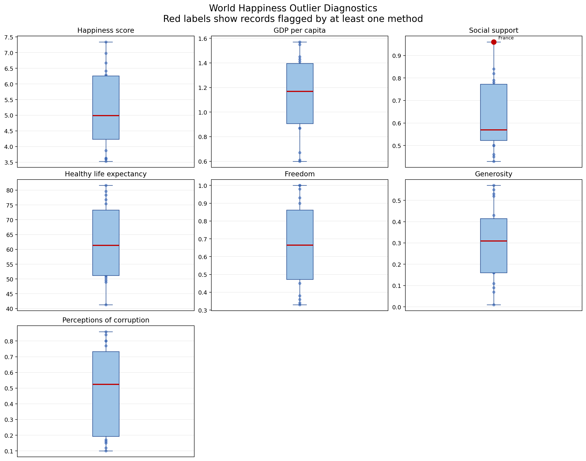

# World Happiness Outlier Detection

This activity cleans `world_happiness_dataset.csv`, detects unusual numeric values, and records an explicit **KEEP** or **DROP** decision. The program does not automatically delete a country merely because it is different from the others.

## Run the program

From the repository root:

```powershell
python week4\act1.2\outlier_detection.py
```

Install the dependencies first if required:

```powershell
python -m pip install -r week4\act1.2\requirements.txt
```

## Data cleaning

Before detecting outliers, the program:

1. Checks that all required columns exist.
2. Trims and standardises country names.
3. Converts the seven analysis fields to numeric values.
4. Removes exact duplicate rows and rows without a country name.
5. Replaces missing numeric values with the median of that feature. Median imputation is used because it is less affected by extreme values than the mean.
6. Aggregates duplicate country names by taking the mean of their numeric values.

For this file, all **20 rows** and all numeric values were complete. No duplicate or unnamed records were found, so the cleaning stage did not remove or impute anything.

### Cleaning audit results

| Cleaning check | Result |
|---|---:|
| Input rows | 20 |
| Required columns found | 8 of 8 |
| Exact duplicate rows removed | 0 |
| Rows without a country removed | 0 |
| Non-numeric values converted to missing | 0 |
| Missing numeric values found | 0 |
| Numeric values median-imputed | 0 |
| Duplicate country rows aggregated | 0 |
| Rows passed to outlier detection | 20 |

## Outlier methods

Outlier detection is performed separately for each numeric feature because the columns use different units and scales.

### 1. Interquartile range (IQR)

The IQR is the difference between the third quartile and first quartile:

```text
IQR = Q3 - Q1
lower bound = Q1 - 1.5 × IQR
upper bound = Q3 + 1.5 × IQR
```

A value outside these bounds is flagged. IQR is useful because quartiles are not strongly influenced by a few extreme observations. No values in this dataset fall outside their IQR bounds.

### 2. Modified z-score

The modified z-score compares a value with the column median using the median absolute deviation (MAD):

```text
modified z = 0.6745 × (value - median) / MAD
```

A value with an absolute modified z-score greater than **3.5** is flagged. This robust version is preferred to the ordinary z-score for this small dataset because the mean and standard deviation can themselves be distorted by extreme values.

### 3. Domain validation

Statistical flags do not prove that a record is wrong. The program therefore also checks reasonable valid ranges:

- Happiness score: 0–10
- GDP per capita: zero or higher
- Social support, freedom, generosity, and perceptions of corruption: 0–1
- Healthy life expectancy: 0–120 years

A domain violation is treated as invalid and assigned **DROP**. A statistically unusual value that remains within its valid range is assigned **KEEP**, unless there is other evidence of a collection or entry error.

## Calculated thresholds for every feature

The following numbers are calculated by the program from the 20 cleaned records. `IQR flags` counts values outside the lower and upper IQR bounds. `MZ flags` counts values where the absolute modified z-score is greater than 3.5.

| Feature | Q1 | Q3 | IQR | IQR lower | IQR upper | Median | MAD | IQR flags | MZ flags | Domain errors |
|---|---:|---:|---:|---:|---:|---:|---:|---:|---:|---:|
| Happiness Score | 4.2375 | 6.2600 | 2.0225 | 1.2038 | 9.2938 | 4.9950 | 1.1900 | 0 | 0 | 0 |
| GDP per Capita | 0.9075 | 1.3950 | 0.4875 | 0.1763 | 2.1263 | 1.1700 | 0.2450 | 0 | 0 | 0 |
| Social Support | 0.5225 | 0.7725 | 0.2500 | 0.1475 | 1.1475 | 0.5700 | 0.0700 | 0 | 1 | 0 |
| Healthy Life Expectancy | 51.1750 | 73.3000 | 22.1250 | 17.9875 | 106.4875 | 61.3500 | 10.6000 | 0 | 0 | 0 |
| Freedom to Make Choices | 0.4725 | 0.8625 | 0.3900 | -0.1125 | 1.4475 | 0.6650 | 0.2000 | 0 | 0 | 0 |
| Generosity | 0.1600 | 0.4150 | 0.2550 | -0.2225 | 0.7975 | 0.3100 | 0.1400 | 0 | 0 | 0 |
| Perceptions of Corruption | 0.1925 | 0.7325 | 0.5400 | -0.6175 | 1.5425 | 0.5250 | 0.2600 | 0 | 0 | 0 |

The negative IQR lower bounds for Freedom, Generosity, and Perceptions of Corruption are statistical fences, not valid data values. Domain validation still requires these features to be between 0 and 1.

## Results and keep/drop decision

Only one value was flagged:

| Country | Feature | Value | IQR result | Modified z-score | Decision |
|---|---|---:|---|---:|---|
| France | Social Support | 0.9600 | Within bounds (0.1475–1.1475) | 3.7579 | **KEEP** |

### Worked IQR calculation for Social Support

For the 20 Social Support values, the program calculates:

```text
Q1 = 0.5225
Q3 = 0.7725
IQR = Q3 - Q1
    = 0.7725 - 0.5225
    = 0.2500

Lower bound = Q1 - 1.5 × IQR
            = 0.5225 - 1.5 × 0.2500
            = 0.1475

Upper bound = Q3 + 1.5 × IQR
            = 0.7725 + 1.5 × 0.2500
            = 1.1475
```

France's value is `0.9600`. Because `0.1475 ≤ 0.9600 ≤ 1.1475`, it is **not an IQR outlier**.

### Worked modified z-score calculation for France

For Social Support, the median is `0.5700` and the median absolute deviation is `0.0700`:

```text
Modified z = 0.6745 × (value - median) / MAD
           = 0.6745 × (0.9600 - 0.5700) / 0.0700
           = 0.6745 × 0.3900 / 0.0700
           = 0.263055 / 0.0700
           = 3.7579
```

Because `|3.7579| > 3.5`, France is flagged by the modified z-score method.

### Domain calculation and final decision

Social Support uses a valid range of 0 to 1:

```text
0.0000 ≤ 0.9600 ≤ 1.0000  → valid
```

The result is therefore:

| Test | France result | Interpretation |
|---|---:|---|
| IQR | Not flagged | 0.9600 is inside 0.1475–1.1475 |
| Modified z-score | Flagged | 3.7579 is greater than 3.5 |
| Domain validation | Valid | 0.9600 is inside the 0–1 scale |
| Final record decision | **KEEP** | Unusual but plausible; no evidence of an error |

France is retained for the following reasons:

- `0.96` is inside the valid 0–1 scale.
- The IQR method does not classify it as an outlier.
- It is high but still plausible for a country-level social-support score.
- The sample contains only 20 diverse countries; deleting legitimate extremes could reduce variation and bias later averages, correlations, or rankings.
- There is no source evidence that the value is a typing or measurement error.

### Overall result totals

| Result | Count |
|---|---:|
| Values flagged by IQR | 0 |
| Values flagged by modified z-score | 1 |
| Values failing domain validation | 0 |
| Records flagged for review | 1 |
| Records kept | 20 |
| Records dropped | 0 |

Therefore, **20 records are kept and zero records are dropped**. If a future record falls outside a defined valid range, the program will mark it `DROP` and exclude it from `analysis_ready_dataset.csv` while preserving it with its reason in the audit outputs.

## Diagnostic chart

The boxplots show each feature's distribution. A red label identifies any value flagged by at least one detection method.



## Generated files

- `outputs/cleaned_with_outlier_flags.csv` — all cleaned records with flag counts, flagged features, and the record decision.
- `outputs/analysis_ready_dataset.csv` — records retained after applying the decisions.
- `outputs/outlier_report.csv` — one row per flagged country-feature value with thresholds, methods, decision, and rationale.
- `outputs/outlier_thresholds.csv` — quartiles, IQR bounds, median, MAD, and flag counts for every feature.
- `outputs/outlier_summary.json` — machine-readable cleaning audit and decision summary.
- `outputs/outlier_boxplots.png` — static Matplotlib diagnostic chart.
