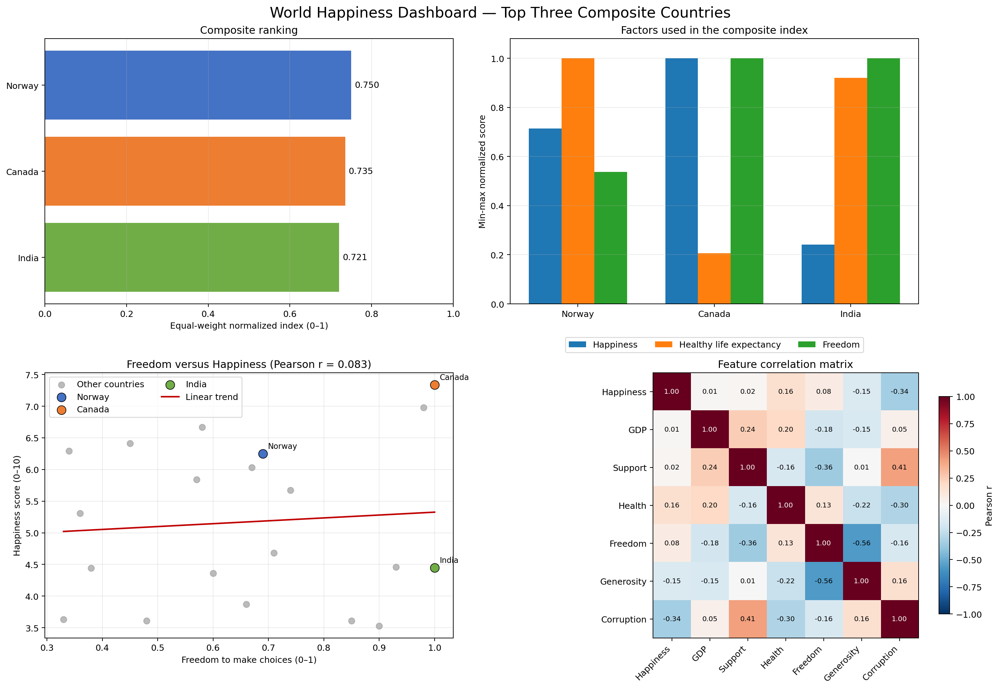

# World Happiness Dashboard: Matplotlib and Plotly

This activity loads `world_happiness_dataset.csv`, validates and aggregates the cleaned country-level data, identifies the three strongest countries using happiness, healthy life expectancy, and freedom, and creates both static and interactive dashboards.

## Run the dashboard

From the repository root:

```powershell
python -m pip install -r week4\act1\requirements.txt
python week4\act1\happiness_dashboard.py
```

Optional paths can be supplied:

```powershell
python week4\act1\happiness_dashboard.py `
  --input week4\act1\world_happiness_dataset.csv `
  --output-dir week4\act1\outputs
```

The Matplotlib dashboard is a static PNG that works offline. The Plotly dashboard is an interactive HTML file; it loads Plotly.js from Plotly's CDN when opened and therefore requires an internet connection.

## Approach

The program follows these steps:

1. Loads the cleaned CSV using pandas.
2. Checks that the required country and numeric columns exist.
3. Trims country names, converts analytical fields to numbers, removes exact duplicates, excludes rows without a country, and mean-fills numeric gaps if a future version contains missing values. The supplied dataset has no missing values.
4. Aggregates repeated country records by taking the mean of every numeric field. The supplied dataset already contains one row per country.
5. Min-max normalises the three required aggregation fields to a common 0–1 scale:
   - `Happiness_Score`
   - `Healthy_Life_Expectancy`
   - `Freedom_to_Make_Choices`
6. Calculates an equal-weight composite index:

   `Composite index = (normalised happiness + normalised health + normalised freedom) / 3`

7. Selects the three highest composite-index countries.
8. Creates matching Matplotlib and Plotly dashboards showing the composite ranking, the three normalised aggregation factors, a direct Freedom-versus-Happiness relationship plot, and a full numeric-feature correlation heatmap.

Normalisation is necessary because happiness is measured on a 0–10 scale, life expectancy is measured in years, and freedom is measured on a 0–1 scale. Averaging the raw values would allow life expectancy to dominate solely because it has larger numbers.

## Findings

| Composite rank | Country | Composite index | Happiness | Healthy life expectancy | Freedom |
|---:|---|---:|---:|---:|---:|
| 1 | Norway | 0.750 | 6.25 | 81.6 | 0.69 |
| 2 | Canada | 0.735 | 7.34 | 49.6 | 1.00 |
| 3 | India | 0.721 | 4.45 | 78.4 | 1.00 |

These are the top three countries under the specified three-factor aggregation, not the raw happiness-score ranking.

- **Norway** ranks first because it has the dataset's highest healthy-life expectancy, above-average happiness, and moderately high freedom.
- **Canada** has the highest raw happiness score and maximum freedom, offset by relatively low healthy-life expectancy in this dataset.
- **India** has maximum freedom and very high healthy-life expectancy, which offsets its lower raw happiness score.

The dataset-wide average Freedom score is **0.661**. Norway's Freedom score is 0.69, while Canada and India both have 1.00.

Across all 20 countries, Freedom and Happiness have a **very weak positive Pearson correlation of r = 0.083**. The scatter plot therefore shows considerable variation around the fitted trend line: a high Freedom score does not consistently correspond to a high Happiness score in this sample.

The strongest absolute relationship between any two features is **Freedom and Generosity, r = −0.563**. This is a moderate negative association in this sample, but it does not establish that either feature causes the other.

## Feature correlation diagram

The correlation heatmap compares all seven numeric features using Pearson's correlation coefficient. Red cells indicate positive relationships, blue cells indicate negative relationships, and values near zero indicate little linear association. The same labelled matrix appears in Matplotlib and Plotly; Plotly also provides exact values on hover.

The correlation heatmap is included as the bottom-right panel of the static Matplotlib dashboard:



## Why bar charts are most appropriate

A **bar chart** is the most appropriate primary chart for this dashboard because:

- Countries are discrete categories rather than a continuous sequence.
- All bars share a common zero baseline, making differences straightforward to compare.
- Exact values can be displayed directly on the bars.
- Only three countries are being compared, so the display remains uncluttered.
- Grouped bars make the three normalised aggregation factors comparable on the same 0–1 scale.

A pie chart would be misleading because the country scores are not portions of a shared total. A line chart would imply time or another continuous order that the dataset does not contain. A scatter plot is useful for examining relationships, but it is less direct than bars for the requested three-country comparison.

The raw Happiness and Freedom bar charts are intentionally omitted because their information is already present in the normalized factor comparison and the relationship plot. A scatter plot is used for Freedom versus Happiness because it is the appropriate chart for examining two numeric variables; each point represents a country, while the fitted line shows the overall linear tendency.

## Matplotlib dashboard

Matplotlib creates a static dashboard suitable for reports, submissions, presentation slides, and offline viewing.
The dashboard is embedded above so the feature-correlation panel can be viewed alongside the ranking and relationship charts.

## Plotly dashboard

Plotly creates an interactive dashboard with hover details, responsive resizing, and an interactive toolbar.

[Open the interactive Plotly dashboard](outputs/plotly_happiness_dashboard.html)

Both dashboards present the same underlying country aggregation and rankings. Each includes a Freedom-versus-Happiness scatter plot with all 20 countries, highlighted top-three countries, a trend line, and interactive hover details in Plotly.

## Generated files

- `happiness_dashboard.py` — cleaning, aggregation, Matplotlib, and Plotly source code.
- `requirements.txt` — Python dependencies.
- `outputs/cleaned_world_happiness.csv` — validated and country-aggregated source fields.
- `outputs/dashboard_dataset.csv` — cleaned country data with normalised factors and composite index.
- `outputs/top_three_happiest.csv` — the selected top-three records.
- `outputs/feature_correlation_matrix.csv` — the pairwise Pearson correlation values visualised in the heatmap.
- `outputs/dashboard_summary.json` — cleaning audit, aggregation definition, weights, and key findings.
- `outputs/matplotlib_happiness_dashboard.png` — static dashboard.
- `outputs/plotly_happiness_dashboard.html` — interactive dashboard generated with Plotly's Python library.
