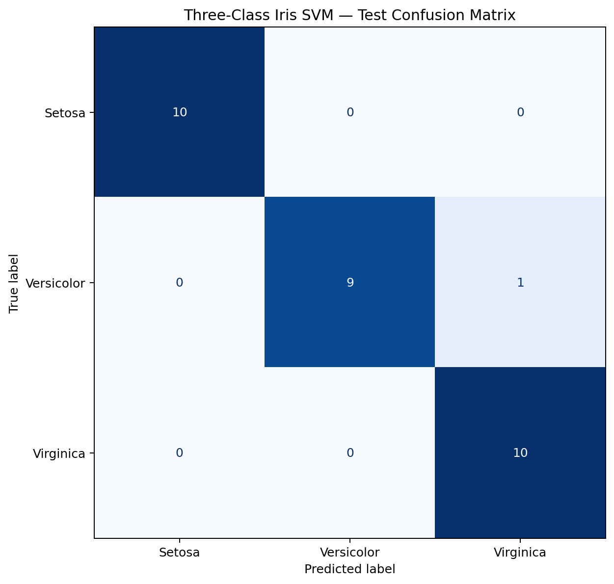
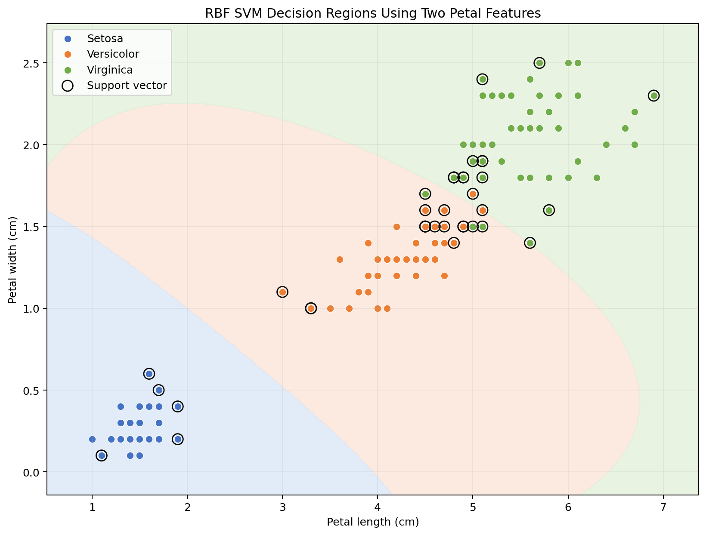

# Three-Class Iris Classification with SVM

This activity trains a Support Vector Machine classifier to predict the three Iris species: **setosa**, **versicolor**, and **virginica**. The implementation follows the official [scikit-learn Support Vector Machines documentation](https://scikit-learn.org/stable/modules/svm.html).

## Run the program

From the repository root:

```powershell
python -m pip install -r requirements.txt
python svm_iris_classifier.py
```

The default dataset path is `../iris.zip`. Alternative paths and model settings can be supplied with:

```powershell
python svm_iris_classifier.py --input ..\iris.zip --test-size 0.20 --random-state 42 --c 1.0
```

## Dataset and cleaning

The ZIP contains 150 flower samples, four measurements in centimetres, and one species label:

- Sepal length
- Sepal width
- Petal length
- Petal width
- Species — the target class

The program reads `bezdekIris.data` directly from the ZIP. This corrected member is used because the accompanying `iris.names` file identifies two measurement discrepancies in the older `iris.data` member.

Cleaning and validation include:

1. Converting all four measurements to numeric values.
2. Removing blank records or records with missing fields.
3. Rejecting non-positive physical measurements.
4. Standardising labels such as `Iris-setosa` to `setosa`.
5. Confirming that exactly the three expected species are available.
6. Assigning a stable sample ID for auditing predictions.

The archive contains 150 complete valid records: 50 setosa, 50 versicolor, and 50 virginica. One later row has the same measurements and label as an earlier virginica row. It is retained because the archive provides no specimen identifier proving that the two measurements came from the same flower; identical measurements can occur for different specimens.

## How the SVM classifier works

An SVM searches for boundaries that separate classes while maximising the margin between those boundaries and the nearest training observations. The nearest influential observations are called **support vectors**.

`sklearn.svm.SVC` supports multiclass classification. For three classes, it internally trains three one-versus-one binary classifiers:

```text
number of classifiers = classes × (classes - 1) / 2
                      = 3 × 2 / 2
                      = 3

setosa vs versicolor
setosa vs virginica
versicolor vs virginica
```

The model uses an RBF kernel, allowing curved decision boundaries:

```text
K(x, x') = exp(-gamma × ||x - x'||²)
```

Settings:

- `kernel="rbf"` — models non-linear class boundaries.
- `C=1.0` — balances a wider margin against training errors.
- `gamma="scale"` — scikit-learn calculates gamma from the feature count and variance.
- `decision_function_shape="ovr"` — returns one decision score per class for convenient reporting, while SVC still trains internally using one-versus-one.

## Why feature scaling is required

SVM distances and RBF kernel values depend on the scale of each input feature. Without scaling, a feature with a larger numeric range could dominate the boundary. A `Pipeline` applies `StandardScaler` using the training data and then passes the scaled measurements to `SVC`:

```text
standardised value = (value - training mean) / training standard deviation
```

Using a pipeline also prevents information from the test set leaking into the scaling calculation.

## Training and evaluation

The program uses a reproducible stratified 80/20 split:

- Training set: 120 flowers, 40 from each species.
- Test set: 30 flowers, 10 from each species.
- `random_state=42` makes the split reproducible.
- Stratification preserves the equal class proportions.

The main evaluation measures are:

- **Accuracy** — correct predictions divided by all test predictions.
- **Precision** — among flowers predicted as a class, the proportion that truly belong to that class.
- **Recall** — among all flowers that truly belong to a class, the proportion found by the model.
- **F1-score** — harmonic mean of precision and recall; useful when both types of error matter.
- **Confusion matrix** — counts actual classes by predicted classes. Correct predictions appear on the diagonal.
- **Five-fold cross-validation** — repeats evaluation across five different validation folds to show whether performance is stable beyond one train/test split.

## Model results

The four-feature SVM correctly classified **29 of the 30 test flowers**:

```text
Accuracy = correct predictions / all predictions
         = 29 / 30
         = 0.9667
         = 96.67%
```

### Per-class results

| Species | Precision | Recall | F1-score | Test samples |
|---|---:|---:|---:|---:|
| Setosa | 1.0000 | 1.0000 | 1.0000 | 10 |
| Versicolor | 1.0000 | 0.9000 | 0.9474 | 10 |
| Virginica | 0.9091 | 1.0000 | 0.9524 | 10 |
| Macro average | 0.9697 | 0.9667 | 0.9666 | 30 |

For example, nine of the ten actual versicolor flowers were found:

```text
Versicolor recall = true positives / (true positives + false negatives)
                  = 9 / (9 + 1)
                  = 0.9000

Versicolor F1 = 2 × precision × recall / (precision + recall)
              = 2 × 1.0000 × 0.9000 / (1.0000 + 0.9000)
              = 0.9474
```

Virginica precision is lower because one versicolor flower was incorrectly predicted as virginica:

```text
Virginica precision = 10 / (10 + 1)
                    = 0.9091
```

### Confusion matrix values

Rows are the actual species and columns are the predicted species:

| Actual \ Predicted | Setosa | Versicolor | Virginica |
|---|---:|---:|---:|
| Setosa | 10 | 0 | 0 |
| Versicolor | 0 | 9 | 1 |
| Virginica | 0 | 0 | 10 |

The one incorrect result was sample 78:

| Sepal length | Sepal width | Petal length | Petal width | Actual | Predicted |
|---:|---:|---:|---:|---|---|
| 6.7 cm | 3.0 cm | 5.0 cm | 1.7 cm | Versicolor | Virginica |

### Five-fold cross-validation

The accuracy scores from the five stratified folds were:

```text
Fold 1: 1.0000
Fold 2: 0.9667
Fold 3: 0.9000
Fold 4: 1.0000
Fold 5: 0.9333

Mean accuracy = (1.0000 + 0.9667 + 0.9000 + 1.0000 + 0.9333) / 5
              = 0.9600
              = 96.00%

Population standard deviation = 0.0389
```

The cross-validation mean is close to the 96.67% test accuracy, which suggests the result is not dependent on only one unusually favourable test split. The variation between folds still matters because the dataset is small.

### Support vectors

The fitted test-evaluation model used 47 of the 120 training flowers as support vectors:

| Class | Support vectors |
|---|---:|
| Setosa | 10 |
| Versicolor | 18 |
| Virginica | 19 |
| **Total** | **47** |

These are the training observations closest to or inside the class margins and therefore have the greatest influence on the decision boundaries.

## Visualisations

The confusion matrix evaluates the four-feature test predictions:



The decision-region chart uses petal length and petal width only because a two-dimensional boundary can be plotted. The evaluated classifier still uses all four measurements.



## Generated files

- `outputs/cleaned_iris.csv` — validated dataset with sample IDs.
- `outputs/test_predictions.csv` — test measurements, actual and predicted classes, correctness, and decision scores.
- `outputs/classification_report.csv` — precision, recall, F1-score, and support for each class.
- `outputs/model_summary.json` — cleaning audit, split, settings, cross-validation, confusion matrix, and metrics.
- `outputs/svm_iris_model.joblib` — fitted four-feature scaler and SVC pipeline.
- `outputs/confusion_matrix.png` — static test confusion matrix.
- `outputs/svm_decision_regions.png` — two-feature RBF decision regions and support vectors.

## Limitations

- Iris is small and unusually clean, so high accuracy does not imply similar performance on larger real-world datasets.
- The decision-region chart is explanatory and uses only two features; it is not the same fitted model used for the reported four-feature test metrics.
- Performance depends on the split and hyperparameters. `C` and `gamma` should be tuned with nested or validation-only procedures before claiming an optimised production model.
